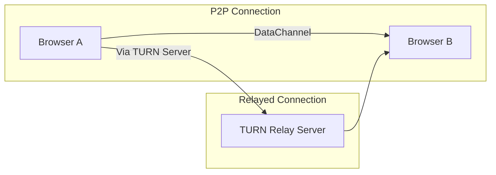

# Executive Summary

Since 2023, browsers have added many new APIs and improvements that could impact a browser-native WebRTC app like QuickBridge. Key developments include **WebTransport** (HTTP/3 QUIC transport) becoming broadly supported by 2026, full support for the **Screen Wake Lock API** (late 2025), and widespread availability of the **Origin Private File System (OPFS)** (from 2023). Meanwhile, challenges remain: mobile Chrome aggressively suspends background tabs (typically ~5 min), iOS still limits background activity for Web apps, and many “experimental” APIs (Background Fetch, Web Share Target on iOS, decentralized signaling, etc.) lack cross-browser support or are not shipping. 

The main implications for QuickBridge are:

- **Persistent “presence” and pairing:** New storage APIs (OPFS, IndexedDB) and manifest settings can enable a “pair once, stay connected” UX, but require careful design since browsers currently drop service workers/tabs when inactive.  
- **Background resilience:** Wake Lock is now stable, but Chrome’s 5-minute suspension on Android means transfers still stall unless the tab stays foreground. Background Fetch remains experimental and unsupported in most browsers.  
- **Data streaming and storage:** OPFS allows streaming writes to disk in-place, making large-file transfers more memory-efficient. WritableStreams and improved Streams APIs are well-supported; WebCodecs (94+) and WebAssembly can accelerate processing (e.g. hashing or encoding).  
- **Emerging transports:** WebTransport (QUIC) is now available in all major browsers except some older versions. It offers reliable and unreliable streams but is client-server (not P2P). QUIC multipath is still an IETF draft. ORTC and insertable streams in WebRTC remain in flux.  
- **Mobile-specific constraints:** iOS still “freezes” PWAs on background (no multi-minute WebRTC without user foreground) and lacks some APIs (e.g. Web NFC, share-target). Android Chrome now supports Wake Lock and has service worker Share Target, but also enforces heavy throttling. New APIs like Background Sync or Periodic Sync are mature (Chrome/Edge) but cannot keep WebRTC alive. 

**Roadmap priorities (8–12 experiments)** should focus on enabling persistent pairing (“trusted devices”), robust resume, and background stability. For example, we might (1) implement a device-registration layer on OPFS/IndexedDB so that after an initial QR handshake the two browsers recognize each other automatically, (2) test using `navigator.wakeLock` in foreground to keep transfers active, (3) stream file writes directly to OPFS and indexedDB to avoid memory bloat, and (4) experiment with WebTransport-based relay fallback. Each experiment should specify success metrics (faster reconnection, no crashes, lower memory) and fallback (e.g. disable if not supported). 

The **compatibility heatmap** below summarizes support for ~12 critical features across browsers. Monitoring sources include Chromium release notes, MDN compatibility data, WebKit’s *Webkit Features in Safari 2025/2026*, and W3C/IETF draft trackers. Key specs/flags to watch in 2024–2026: persistent service workers, datachannel in workers, OPFS on iOS, WebTransport enhancements, QUIC multipath (drafts), Background Fetch, and any Apple announcements at WWDC (e.g. Safari improving PWA background).

*Figures: Typical fallback flow for peer connection (WebRTC direct vs. TURN relay)*  

# 1. Core Transport & P2P APIs

- **WebRTC DataChannel (SCTP/DTLS).**   P2P, encrypted, ordered (by default) data paths. *Status:* Supported in all browsers (Chrome, Edge, Firefox, Safari) and on mobile (Android/iOS) for years. Firefox and Safari now support the *unordered* and *partial-reliability* modes of RTCDataChannel (SCTP) as well. Newer enhancements include *insertable streams* (encoded media transformation) and plans for datachannel in web workers (Apple announced RTCDataChannel-in-worker at WWDC 2023). *Implications:* No change needed for baseline P2P. Opportunity: unordered/unreliable mode could reduce latency for streaming or handshake messages. Risk: some older browsers (e.g. Safari < v18) may still lack new features; we must polyfill or disable if unavailable. *Notes:* Continue using STUN/TURN. Consider experimenting with “[insertable streams]”(https://www.w3.org/TR/webrtc-insertable-streams/) to e.g. checksum chunks on the fly.

- **WebRTC ICE/Trickle/Restart.**   Modern ICE with trickle-candidates is fully supported. Chrome now supports ICE restart for renegotiation, but QuickBridge already tears down and re-creates PC on disconnect. No major new features in late 2023–2026, aside from better ICE heuristics. *Implications:* Unchanged. Possibly reduce full reconnect overhead if ICE-restart in-place (currently QuickBridge does full renegotiation). *Notes:* Monitor Chrome’s new “faster ICE handshakes” improvements in release notes.

- **RTCDataChannel reliability/encryption.**   All browsers use DTLS1.3 and SCTP under the hood. No changes expected. One limitation: no built-in integrity check after resume. *Implications:* Could optionally compute and compare hash via WebCrypto after transfer. *Notes:* Use WebCrypto or libraries to verify large-file integrity as an extra step.

- **WebTransport (HTTP/3 over QUIC).**  A new multiplexed, low-latency transport API for client-server links. **Support:** Chrome 97+, Edge 97+, Firefox 114+; Safari 16.4+. (As of mid-2026, Safari supports WebTransport on macOS/iOS.) *Maturity:* Stable; no flags needed in up-to-date browsers. *Implications:* Not directly peer-to-peer (always to a server). Could be used for *relayed transfers or signaling* as an alternative to WebSocket/STOMP. E.g. QuickBridge could implement a WebTransport relay or fallback server. Also supports unreliable datagrams for low-latency updates. *Risk:* Involves sending data via your server, losing end-to-end encryption. Should only be used for metadata or non-sensitive data. *Notes:* Simple to polyfill: use WebSocket or normal HTTPS if needed. See MDN/WebTransport for examples.

- **WebSockets / HTTP3 improvements.**  WebTransport is effectively HTTP/3 + QUIC streams. Aside from WebTransport, the Fetch/XHR/Fetch with `keepalive` are stable. HTTP/3 is widely available now (Chrome, Edge, Firefox, Safari). *Implications:* No direct change, but QuickBridge’s signaling (Supabase Realtime) uses WebSockets; could experiment with WebTransport/HTTP/3 for lower latency signaling (supported in Chrome/Firefox but maybe not Safari). 

# 2. Media and Streams APIs

- **MediaDevices / getUserMedia / getDisplayMedia.**   Screen capture (`getDisplayMedia`) and camera/microphone capture are fully supported across browsers. The `systemAudio` option (Chrome 105+) now captures tab or system audio. *Implications:* QuickBridge already scans QR from camera; could allow capturing desktop or tab to share full screen. Desktop sharing works well on Chrome/Edge (and Firefox with a prompt); Safari now supports basic screen sharing. *Notes:* Use feature-detection and fall back to camera for QR when no screen capture.

- **MediaStreamTrackProcessor/Generator.**   These allow piping media (video/audio) through `TransformStream` for processing. **Support:** Video processing is behind flag or in Safari 18+ tech previews; Firefox will have it soon. AudioData support arrived in Safari 18+ (not widely in Chrome/FF). *Implications:* Not critical for file transfer, but could enable advanced features like real-time filters or compression. Likely skip in short term unless building complex media features. 

- **WebCodecs.**  Low-level encoding/decoding API for video/audio. **Support:** Chrome/Edge 94+, Firefox 130+, Safari 16.4+ (partial in 16.4–18.7, full in 16.0+ as of current Apple updates). *Implications:* Might allow hardware-accelerated image or video encoding on-the-fly. QuickBridge could use it for e.g. encoding a video stream for remote screenshare or optimizing clipboard images. Alternatively, use WebAssembly (Wasm) for heavy compute. *Implementation:* Polyfill not available; fallback to `canvas.captureStream()` etc if needed. 

- **WebGPU.**  Graphics/compute GPU API. **Support:** Chrome 113+, Firefox ~141+ (2026), Safari 17+ (macOS 13/vista/monterey etc). *Implications:* Possibly to accelerate tasks like large-file hashing (SHA-256) or data encryption in JS. Could speed up chunk hashing or encryption, but adds complexity. Worthy as a future experiment if CPU becomes bottleneck. *Notes:* WebGPU is secure context only and requires feature detection.

- **WebAssembly & JSPI.**  WebAssembly is fully supported. The new JS-API interoperability (JSPI) is experimental (wasm-tail-call in Safari 17+). Unlikely needed unless embedding custom codecs. *Implications:* If QuickBridge uses WebAssembly libraries (e.g. libsodium for encryption, SQLite for indexing), these run normally. No new issues beyond standard PWA caution.

# 3. Storage and File APIs

- **Origin Private File System (OPFS).**  Provides fast, origin-local file storage (synchronous access inside workers, optimized writes). **Support:** Chrome 108+ (2023), Edge, Firefox 118+, Safari 18.4+ (mid-2025). *Maturity:* Stable in all modern browsers as of 2025. *Implications:* QuickBridge can use OPFS to **stream large file downloads/writes to disk**, avoiding huge in-memory Blobs. This is critical for large transfers. (Already partially used for “auto-save”.) Also use OPFS for storing pairing tokens or state. *Implementation:* Use the FileSystem APIs (e.g. `navigator.storage.getDirectory()` then `getFile()` etc, or via `FileSystemSyncAccessHandle` in workers). Note: In Safari, full OPFS support arrived only after the finalization of WritableStreams bug in iOS 18.4. Use feature detection.

- **File System Access (Native picker).**  `showOpenFilePicker()`, `showDirectoryPicker()` etc. All modern desktop browsers support these (Chrome, Edge, Firefox, Safari on macOS). iOS does *not* support this (web apps on iPhone cannot pick files). *Implications:* For the “Send” UI, QuickBridge can rely on file pickers on desktop/Android, but on iOS must rely on input[type=file] (Safari’s native file dialog) or share sheet. For saving, use `createWritable()`. These are already used in QuickBridge for user-initiated save/download; nothing new beyond normal use.

- **Streams API (ReadableStream/WritableStream).**  Fully supported everywhere. QuickBridge already uses streams to pump chunks; this is stable. The improved **WritableStream in service worker** allows streaming file writes (Background Fetch also uses it under the hood). No compatibility issues.

- **Background Fetch API.**  Designed to allow downloads in a service worker even if page closes. **Support:** Currently only in Chrome 81+ (origin trial now) and behind flag; *not* in Firefox or Safari (experimental/standardization stage). *Implications:* A potential solution for resuming or continuing downloads across sessions, but not reliably available. Likely skip for now or flag as “experimental — Chrome only”. 

- **IndexedDB improvements.**  New methods like `IDBObjectStore.getAllRecords()` (Safari 18+, Chrome 121+) can speed up store iterations. *Implications:* Could slightly improve resume/performance logic if using IndexedDB for tracking incomplete transfers. Not critical, but use it when available. (We should test if Chrome/Firefox have these new methods.)

# 4. PWA & Background Behavior

- **Wake Lock API.**  The Screen Wake Lock (`navigator.wakeLock.request('screen')`) is fully supported in Chrome 107+, Edge 107+, Firefox 126+, and Safari 15.5+. (In practice, all modern versions support it.) *Maturity:* Stable since early 2025. *Implications:* QuickBridge can use this in the foreground to prevent device sleep during long transfers. This helps keep Chrome on Android active. Note that on iOS Safari 16.4+, Wake Lock works in normal tabs, and as of iOS 18.4 even in PWAs. But if user backgrounds the PWA/tab, locks are released automatically. *Implementation:* Call `await navigator.wakeLock.request('screen')` and handle `'release'` events. Always catch failures (e.g. if another app already has a lock or user enabled battery saver).

- **Background Sync / Periodic Sync.**  Background Sync (for short tasks when connectivity returns) and Periodic Sync are supported in Chrome/Edge (Chrome 96+/Firefox not yet). *Implications:* Useful for scheduling retries or state sync, but cannot keep WebRTC alive. Could use background sync to re-establish connection when the user re-opens the app, but mainly, QuickBridge relies on “handoff” in the active session. 

- **Background Fetch (again).**  Not standard (Chrome only). See above; we treat it as future possibility, not in roadmap.

- **Web Push / Notifications.**  All modern browsers support Push API and Notifications (Safari on macOS, not iOS). Could be used to notify a user of transfer completion if the app is background, but QuickBridge sessions are ephemeral and device-aware; push might be out of scope. *Implications:* Could experiment with push to signal reconnection or offline resume offer.

- **Service Workers:**  Core tech for PWA. **Recent changes:** Safari 17.4 (Sep 2023) and Chrome 111+ improved SW lifecycle (responding to `postMessage` if closed). No official support for *truly persistent* service workers with long-running timers (there is a W3C issue [#1728] opened in 2024 to allow installed PWAs to keep SW alive, but it’s unresolved). *Implications:* QuickBridge cannot rely on SW to maintain a live connection in background. Workarounds like *music playback* or *WebRTC in SW* are not feasible. Best approach is to encourage user to keep the tab open, and use wake lock.

- **Web Share Target.**  Allows PWAs to register as a target for OS share (content provider). **Support:** Chrome on Android and Edge (mobile) support it; Safari (iOS) does **not** support share_target in PWAs. *Implications:* QuickBridge’s Android “share to QuickBridge” (using Web Share Target) will work only on Android devices. iOS users must manually open the app and use its UI. 

# 5. Device & Identity APIs

- **Permissions API.**  Offers unified queries (e.g. `navigator.permissions.query({name:'camera'})`). Fully supported. Good for UX (prompting user, showing status) but no major changes. *Implications:* Use to check if camera/microphone access is allowed before trying QR scan; also for clipboard access.

- **WebAuthn / Credential Management.**  While QuickBridge is account-less, WebAuthn (passkeys) could be used for device identity in the future, but complicated. Not a focus. 

- **BroadcastChannel / SharedWorker.**  These allow cross-tab communication. BroadcastChannel is well-supported; SharedWorker is supported on desktop Chrome/Firefox/Safari 16+, but *not* on Chrome for Android. *Implications:* Could use BroadcastChannel to sync state if QuickBridge page is open in two tabs on the same device. Not critical for single-session P2P.

- **WebRTC-insertable streams / ORTC.**  Already covered in Media. These allow e2e custom encryption or media injection. Unlikely needed for file transfer.

- **Cross-Origin Isolation.**  Only relevant if using SharedArrayBuffer or advanced features. QuickBridge does not need it.

# 6. Emergent Transport & Signaling Alternatives

- **WebTransport over QUIC.**  (Covered above.) Could serve as an *alternative signaling or relay channel*. If QuickBridge’s Supabase signaling is ever a bottleneck, consider WebTransport to a custom server (maybe cheaper than TURN). Also supports un-ordered datagrams for real-time control messages (like an advanced WebSocket). But lacking native P2P, it always involves a server. 

- **WebRTC DataChannel in Workers.**  **Spec:** It’s in progress (W3C WebRTC WG); Chrome and Firefox may implement soon, Safari mentioned at WWDC 2023. *Implications:* Once available, could run QuickBridge’s RTC logic in a Web Worker or dedicated worker, possibly avoiding UI thread freeze (though tab suspension is still killer). Not immediate.

- **WebSockets vs WebTransport / QUIC.**  Standard WebSocket still works and is well-supported. WebTransport is the upcoming alternative with multipath/quic. For signaling, plain WebSockets (over HTTP/1.1) remain fine and compatible. WebTransport could reduce overhead (HTTP/3 multiplexing), but Safari adoption only recently. 

- **Decentralized signaling (serverless).**  Proposals exist (WebRTC “signaling mesh”, or using WebPush as wake-up). Not stable: blockchain solutions (impractical latency), mesh networks (innovative but not mainstream). This is beyond current QuickBridge scope, but worth tracking some research like “WebRTC Swarms (MDPI paper)” or libp2p-style DHTs. Not actionable now.

- **WebPush for wakeups.**  One idea: use push notifications to wake a service worker and re-establish a session (some apps use silent push to sync). QuickBridge could theoretically send a push to the paired device asking it to re-open QuickBridge page. However, iOS Safari does not support web push (as of 2026) and requires user subscription. Risky, unlikely to solve background tab issue since SW cannot hold RTC. 

- **QUIC multipath / datagrams (WebTransport datagram).**  QUIC multipath is an IETF draft; no browser support yet. WebTransport does support *datagrams* (unreliable, unordered) to the server. QuickBridge might use WebTransport datagrams if switching to a server model, but overkill for file data (DataChannel already handles loss). Skip.

# 7. Mobile-Specific Constraints & APIs

- **Android Chrome Tab Throttling.**  Chrome on Android aggressively limits background activity. In practice, as early as 2018 Chrome suspends tabs after ~5 minutes inactive. Even without throttling, Chrome’s “background service limit” often suspends DOM execution quickly. *Implication:* If the user navigates away or locks screen for >5 min, QuickBridge’s DataChannel stalls or disconnects. **Mitigations:** Use Wake Lock to keep screen on (prevent locking) during transfers. Encourage using the installed PWA (which is slightly less aggressive than Chrome tab). 

- **iOS Safari Restrictions.**  WebKit forces web apps to pause when in background. No workaround unless app is a native or playing silent audio (not applicable). iOS Safari only now supports OPFS (from iOS 17 with Full File System API), but still **loses all storage** if user clears data or reinstall iOS (like all web data). Web Share Target and Web Push are not supported. *Implication:* Accept that on iPhones you cannot do background transfers or share without user. QuickBridge can still run when frontmost, but if user switches app or locks, transfer pauses or fails. Workaround: instruct users to keep QuickBridge open and screen awake. Use WakeLock and display progress.

- **PWAs on Mobile.**  iOS allows adding to Home Screen, but that still runs Safari engine with the same limits. Android PWAs behave similarly to Chrome with some enhancements (Standalone window, some background). Use the PWA install for slightly more stability (sometimes Android gives PWAs higher memory, but not guaranteed). Use manifest flags to ensure “Keep Awake” style features (Wake Lock). The recent fixes in Chrome 2025 make WakeLock work in PWAs too (no known outstanding bugs).

- **New Android APIs:** WebAPK enhancements, maybe upcoming “persistent WebView” Android system PWA mode (Project Mercury was canceled). No known shipping feature helps. 

- **Mobile Data vs Wi-Fi NATs:** No new solution; TURN (and WebTransport fallback) remain essential. QuickBridge already uses Cloudflare TURN by default, which is fine. Note: Many carriers now support IPv6 and DNS64, making v4 NAT rarer on dual-stack.

- **Web OTP / WebNFC:** Not relevant for QuickBridge. 

- **WebBluetooth:** Not relevant (we use QR, NFC is a stretch).

- **Android Intent intercept:** Already using Share Target for Android.

# 8. Recommended Experiments / Roadmap

We suggest **8–12 concrete experiments** for the next 12–18 months. For each, specify goal, hypothesis, APIs, targets, metrics, effort, fallback.

1. **Persistent Device Pairing (Presence Layer).**  
   - *Goal:* After one-time QR/PIN pairing, remember peers for future quick connect (“My Devices” list).  
   - *Hypothesis:* Storing a long-lived pairing token or key in OPFS/IndexedDB allows automatic reconnection without scanning each time, greatly reducing friction.  
   - *APIs:* OPFS or IndexedDB to store a signed pairing token (e.g. a GUID with expiration or key+expiry). Use `localStorage` or `navigator.storage.estimate()` for quota checks. Possibly WebAuthn to tie to user, but optional.  
   - *Browsers:* All modern (Chrome, Firefox, Safari) since basic storage. iOS 17+ for OPFS; fallback to IDB for older Safari.  
   - *Success:* User’s second device appears instantly in “Known Devices” and session opens in <5s on click.  
   - *Effort:* Medium (M) – implement token generation, storage, UI.  
   - *Fallback:* If storage unsupported, still require full QR each time.  

2. **Stream-to-Disk with OPFS.**  
   - *Goal:* Improve large-file transfer by writing chunks directly to OPFS as they arrive, eliminating intermediate Blobs.  
   - *Hypothesis:* This will drastically reduce memory usage and allow >2GB files on all devices, smoothing large transfers.  
   - *APIs:* File System Access / OPFS (`navigator.storage.getDirectory()`, `createWritable()`). WritableStream writes to file.  
   - *Browsers:* Chrome/Edge/Firefox/Opera stable. Safari 18+ (iOS 17+) for OPFS; for older Safari, use normal blob-download fallback or IndexedDB.  
   - *Success:* 1GB file transfers complete in-memory usage ~20MB (buffer size), and survive typical interruptions.  
   - *Effort:* Large (L) – implementing stream-to-file and testing on all platforms.  
   - *Fallback:* Continue using Blobs for Safari <18.  

3. **Screen Wake Lock & UI Keep-Alive.**  
   - *Goal:* Prevent mobile devices from sleeping mid-transfer.  
   - *Hypothesis:* Using WakeLock during active transfers will keep Android/iOS screens on and avoid throttling.  
   - *APIs:* `navigator.wakeLock.request('screen')`, release on pause/finish.  
   - *Browsers:* All modern (Chrome 84+, Safari 15.5+, Firefox 126+).  
   - *Success:* Battery/screen-off not allowed during transfer; transfer does not pause unexpectedly if user keeps the device plugged/awake.  
   - *Effort:* Small (S) – add API call around transfers, prompt user to allow.  
   - *Fallback:* If WakeLock fails (permissions or older browsers), show warning “Keep screen on”.  

4. **IndexedDB Resume on Reload.**  
   - *Goal:* Allow a transfer to resume if page/tab reloads (e.g. accidental refresh).  
   - *Hypothesis:* Storing incomplete file offsets and chunk UUIDs in IndexedDB enables app to pick up where it left off (using current resume logic).  
   - *APIs:* IndexedDB store transfer metadata (filename, offset, checksum of chunks). On reconnect, auto-send resume message.  
   - *Browsers:* All. Use `getAllRecords()` where available to speed up retrieval.  
   - *Success:* User refreshes mid-transfer, re-opens page, selects same device – transfer continues instead of restarting from zero.  
   - *Effort:* Medium (M). Implement DB schema and logic.  
   - *Fallback:* No DB support = restart from zero (current behavior).

5. **Use WebTransport for Relay Fallback.**  
   - *Goal:* If direct WebRTC fails or TURN unreachable, test WebTransport to a QuickBridge relay server.  
   - *Hypothesis:* WebTransport connections to a TURN-like server may succeed where UDP/TURN fails, improving cross-network reliability.  
   - *APIs:* `WebTransport()` to our own relay with HTTP/3 support. Datagrams or bidirectional streams for control.  
   - *Browsers:* Chrome/Edge/Firefox (Safari has WebTransport only in latest; if missing, fallback to TURN).  
   - *Success:* On network scenarios where TURN fails (e.g. IPv6-only network blocking UDP), WebTransport (HTTP3) establishes and relays data.  
   - *Effort:* Large (L) – requires server implementation (could reuse openrelay.metered.ca if it supported H3) and client logic.  
   - *Fallback:* If not supported or fails, continue using current TURN (or openrelay).

6. **Network Path Multipath (Experimental).**  
   - *Goal:* Investigate using multiple interfaces simultaneously (e.g. Wi-Fi + cellular).  
   - *Hypothesis:* If devices have multiple connections, multipath could yield higher throughput or failover.  
   - *APIs:* None in browser yet. Possibly use separate WebTransport/WebSocket on different ICE candidates (if device provides). Or test Qualcomm’s Multi-Path TCP via native app (out of scope).  
   - *Browsers:* *N/A* (no support yet).  
   - *Success:* Demonstrate concept on at least Chrome using two DataChannels (one over Wi-Fi, one over mobile) combining speed.  
   - *Effort:* Very large/Speculative (L). Likely skip until multipath QUIC is standardized.  
   - *Fallback:* Single-path only.

7. **Clipboard & Link Transfer as “Progressive Presence”.**  
   - *Goal:* Turn QuickBridge into a fast “clipboard and link sync” tool between known devices.  
   - *Hypothesis:* Many transfers are small (text/URLs); offering an “always-on clipboard channel” makes the product sticky.  
   - *APIs:* BroadcastChannel (in a page if open on both devices), or better: an always-connected P2P DataChannel for clipboard, even when not explicitly in file-transfer mode. Use `navigator.clipboard` and share updates.  
   - *Browsers:* Most. (Clipboard API is available on HTTPS and sometimes with permission.)  
   - *Success:* Copying text on phone instantly pastes on laptop’s QuickBridge session.  
   - *Effort:* Medium (M). Reuse presence link.  
   - *Fallback:* Users can always manually paste; not critical.

8. **Optimistic Pin-Join (“Pair on PIN Entry”).**  
   - *Goal:* Allow either device to enter a numeric PIN to join existing session, without QR.  
   - *Hypothesis:* Some users prefer typing a PIN on another device rather than switching screens to scan.  
   - *APIs:* UI only. (Use existing signaling).  
   - *Browsers:* All.  
   - *Success:* A user on a locked iOS can type PIN instead of scanning a QR from Android.  
   - *Effort:* Small (S). UI and backend signaling already have PIN support (original UX had PIN).  
   - *Fallback:* Always have QR fallback as now.

9. **DataChannel Fallback to WebSocket (Enterprise mode).**  
   - *Goal:* In very restrictive networks (e.g. corporate proxies), use WebSocket relay instead of TURN.  
   - *Hypothesis:* Opening an encrypted WebSocket to a known relay server could traverse HTTP proxy when UDP is blocked.  
   - *APIs:* WebSocket (service-based relay). QuickBridge would serve as “server” forwarding between clients.  
   - *Browsers:* All.  
   - *Success:* Demonstrate a transfer on a network where TURN is blocked but HTTPS is open.  
   - *Effort:* Large (L). Requires server component and client fallback.  
   - *Fallback:* Likely not worth if TURN works most cases.

10. **Background Transfer via Service Worker (Vision).**  
    - *Goal:* (Long-term idea) If “persistent service worker” ever ships, test keeping DataChannel alive in background.  
    - *Hypothesis:* A future PWA background mode would allow transfers even when app isn’t frontmost.  
    - *APIs:* Hypothetical persistent SW or background WebRTC API (none today).  
    - *Browsers:* Future – track feature status.  
    - *Success:* (Speculative) If Chrome allows a service worker to maintain a WebRTC PC, a transfer could run even if user switches apps.  
    - *Effort:* Speculative. *Skip until platform support.*  
    - *Fallback:* Continue instructing users to keep tab open.

11. **Peer-to-Peer Contact Discovery (Speculation).**  
    - *Goal:* Allow finding QuickBridge “friends/devices” via local network (mDNS/DNS-SD) or Bluetooth.  
    - *Hypothesis:* If two devices open QuickBridge on same LAN, they could detect each other without scanning.  
    - *APIs:* [Not available in browsers yet – WebBluetooth or WebNFC are hardware-specific]. Could simulate via LAN broadcast server or manual selection.  
    - *Browsers:* n/a.  
    - *Success:* (N/A, no standard web API).  
    - *Effort:* Skip – more relevant to localSend-style apps.

12. **Encryption Integrity Check (Add-on).**  
    - *Goal:* After transfer, automatically verify file integrity via hash (optional feature).  
    - *Hypothesis:* Many users trust SCTP reliability, but a built-in checksum (e.g. SHA-256) check would reassure power users.  
    - *APIs:* WebCrypto (`crypto.subtle.digest`) to compute hash on file, compare between sender/receiver via DataChannel messages.  
    - *Browsers:* All.  
    - *Success:* Mismatch detection reports error and offers retry.  
    - *Effort:* Medium (M). Hashing can be heavy on large files; do it on separate thread (WebWorker).  
    - *Fallback:* If hash fails or slow, allow user to skip. Not mandatory.

Each experiment should be scoped small-to-medium initially, with measurable goals (e.g. “transfer doesn’t crash out-of-memory”, “session reconnects in <3s”, “90% of idle-time prevented sleeping with WakeLock”). Document results and decide whether to incorporate.

# 9. Compatibility & Support Matrix

Top 12 APIs/features and browser support summary (stable as of mid-2026; ✔ = supported/stable, ◐ = partial/behind-flag, ✘ = not supported):

| **Feature / Browser**               | **Chrome/Edge (Desktop)** | **Firefox (Desktop)** | **Safari (macOS)** | **Chrome on Android**   | **Safari on iOS**     |
|------------------------------------|:-------------------------:|:---------------------:|:------------------:|:----------------------:|:---------------------:|
| **WebRTC DataChannel (SCTP/DTLS)** | ✔ (all modes)             | ✔ (all modes)         | ✔ (most modes)     | ✔                     | ✔                     |
| **WebTransport (HTTP/3)**          | ✔ (v97+)   | ✔ (v114+)            | ✔ (16.4+, partial earlier) | ✔ (v150+)        | ✔ (16.4+)            |
| **WebCodecs**                      | ✔ (v94+)    | ✔ (v130+)            | ✔ (partial 16.4–18, full 16.0+) | ✔ (v150+)       | ✔ (16.4+)           |
| **OPFS (FileSystem)**              | ✔ (v108+) | ✔ (v118+)            | ✔ (18.4+, experimental earlier) | ✔ (v108+)       | ✔ (18.4+)           |
| **Streams API**                    | ✔ (stable)               | ✔ (stable)           | ✔ (stable)         | ✔ (stable)            | ✔ (stable)           |
| **WakeLock (screen)**              | ✔ (v84+)  | ✔ (v126+)           | ✔ (v16.4+)         | ✔ (v84+)             | ✔ (iOS 16.4+, PWA: iOS 18.4+) |
| **Web Share Target (PWA)**         | ✔ (Android)              | ✘ (desktop mobile)   | ✘                 | ✔ (Android)           | ✘ (iOS)               |
| **Background Fetch**               | ✔ (flag/Chrome only)      | ✘ (no support)      | ✘                 | ✔ (flag)             | ✘                   |
| **Web NFC**                        | ✔ (Android)               | ✘                  | ✘                 | ✔ (Android)           | ✘                   |
| **IndexedDB.getAllRecords()**      | ✔ (Chrome 121+)           | ✔ (Firefox)         | ✔ (Safari 18+)    | ✔ (Chrome 121+)       | ✔ (iOS 18+)          |
| **WebGPU**                         | ✔ (v113+)     | ✔ (v141+)           | ✔ (Safari 17+/18+) | ✔ (v113+)  | ✘ (iOS Safari: 18+) |
| **WebSocket / HTTP/3**             | ✔ (native)                | ✔                   | ✔                 | ✔                     | ✔                   |

**Notes:** Safari on iOS has the most limitations: no Web Share Target, stricter background suspend, and only recent support for OPFS and WakeLock (PWA only). Chrome on Android closely follows desktop Chrome, but enforces 5-min background suspend. Firefox on Android lags behind desktop in some features (e.g. SharedWorker, WebGPU initial support only). Always test individually on target platforms.

# 10. Monitoring & Watchlist

**Key sources to monitor:**

- **Chromium Release Notes & Issue Tracker:** For upcoming features (e.g. WebRTC changes, QUIC, background fetch flags). The [Chrome Status Dashboard](https://chromestatus.com/) and chromium blog are essential.
- **WebKit (Safari) Feature List:** WebKit blogs (“Safari Tech Preview” notes, [WebKit Feature Status](https://webkit.org/status/)). Particularly track OPFS, Background Fetch, WebRTC support, PWA changes.
- **Firefox (Mozilla) Portal:** MDN “Web API” pages (often updated) and Firefox Bugzilla for specs like WakeLock (when Firefox 126+ stable supports).
- **WHATWG/W3C Specifications:** For “WebRTC Insertable Streams”, “WebTransport”, “Background Fetch”, etc. See GitHub repos (W3C WebRTC WG, IETF QUIC drafts). 
- **IETF QUIC/RTCWeb lists:** E.g. [IETF QUIC Working Group draft-ietf-quic-multipath] for multipath QUIC.
- **Developer Blogs:** web.dev and webrtcHacks for high-level overviews (e.g. the WebCodecs+WebTransport article).
- **MDN Compatibility Tables:** These should be checked periodically (MDN gets updated with new flags and notes).

**Watchlist (specs / flags):**

- **Service Worker “Persistent in PWA”** (W3C SW issue #1728): tracking any resolution (likely mobile Chrome only).  
- **DataChannel in Workers:** (e.g. Safari’s implementation of RTCDataChannel in background thread) – watch Apple’s WWDC and Blink discussions.  
- **Background Fetch API:** See WHATWG discussions; Chrome “feature flag” changes.  
- **Periodic Background Sync:** Check Chrome platform status for stable ship (Chrome 109+ had it behind flag).  
- **WebTransport over HTTP/3:** Already shipping; watch for Server Sent Events (SSE) to HTTP/3 transition, and Datagrams in WebTransport.  
- **QUIC Multipath:** Track IETF draft-ietf-quic-multipath. Unlikely in browsers soon.  
- **Android PWA enhancements:** E.g. any “Web Capabilities Project” announcements at Google I/O (2024/25).  
- **iOS Safari 18/19 features:** Apple WWDC announcements – e.g. any expansion of web capabilities (we saw WakeLock fix in iOS 18.4).  
- **WebBundle / Portals:** Though not directly relevant, could offer new offline transfer methods (skip for now).  
- **Security/Privacy laws:** Watch if any regulation affects peer-to-peer (e.g. IP leaks, cross-origin restrictions).  

# 11. References

- WebTransport MDN – support and API overview.  
- WebTransport Caniuse.  
- WakeLock MDN – baseline 2025 support.  
- OPFS MDN – widely available from 2023.  
- WebCodecs Caniuse.  
- WebRTC Hacks – discussion of WebTransport vs WebRTC.  
- Reddit (Announcing OPFS on Safari) (by ChadNauseam).  
- Chromium devs on background throttling (Android tabs 5-min suspend).  

